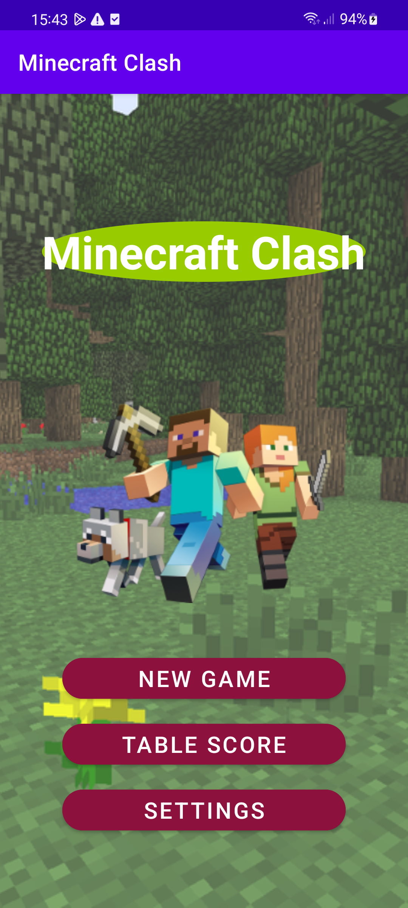
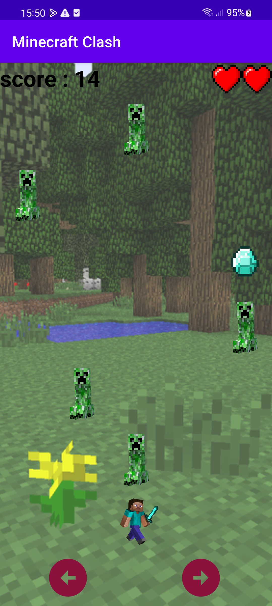
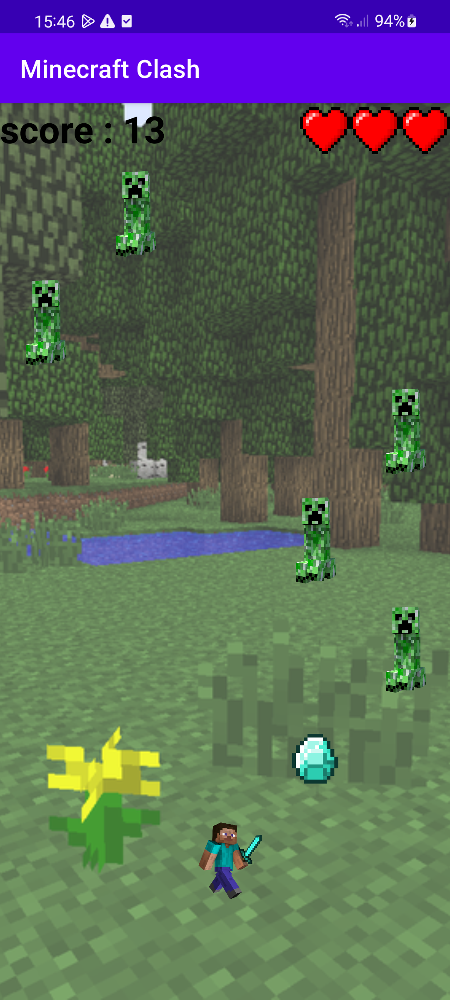
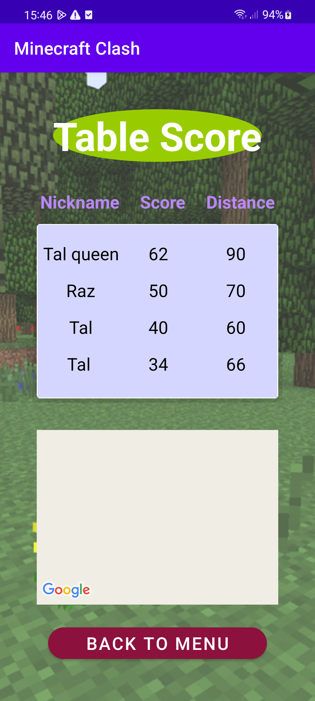

# Minecraft Clash

**Minecraft Clash** is a fun and fast-paced Android game built with Java in Android Studio. 
In this game, you take control of **Steve**, who must dodge falling **Creepers**, collect **Diamonds** to earn points.

## ⚙️ Featurs

- **Leaderboard:** At the end of the game, enter your name. If your score is high enough, you'll appear in the **Winners Table**.

Players can customize the game experience to suit their style:

- **Control Modes:**
  - **Controller Mode:** Use on-screen arrows to move Steve left and right.
  - **Tilt Mode:** Use your phone's **gyroscope** to control Steve by tilting the device.

- **Speed Levels:**
  - Choose from **4 difficulty levels**: *Easy*, *Normal*, *Hard*, and *Master*.
  - Higher difficulty = faster Creepers!

## 🚀 Getting Started

1. Clone or download the project.
2. Open it in Android Studio.
3. Build and run it on an Android emulator or physical device.
4. Choose your settings and start playing!

## 📸 Screenshots

  

  

  

  

## License
MIT License

Copyright (c) 2025 Tal Bar

Permission is hereby granted, free of charge, to any person obtaining a copy.

## Credit
Icon made by Flat Icons from www.flaticon.com

Enjoy the game and feel free to contribute or give feedback!
